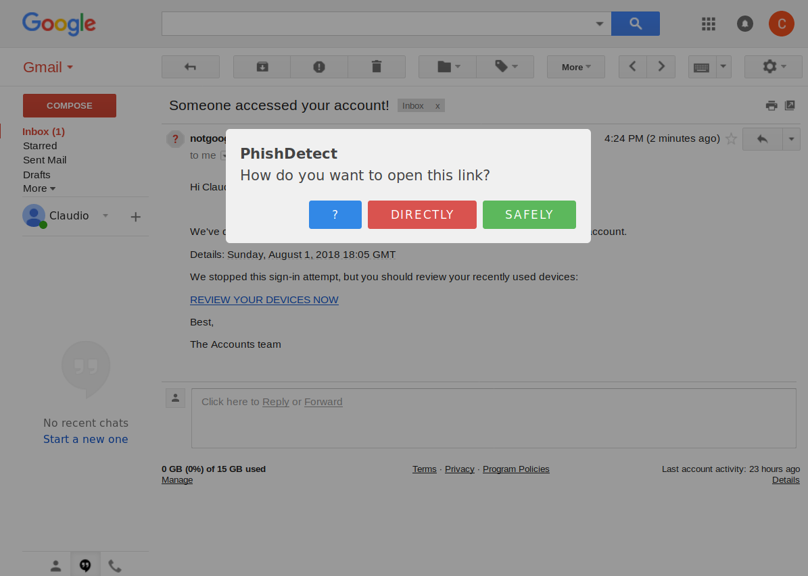
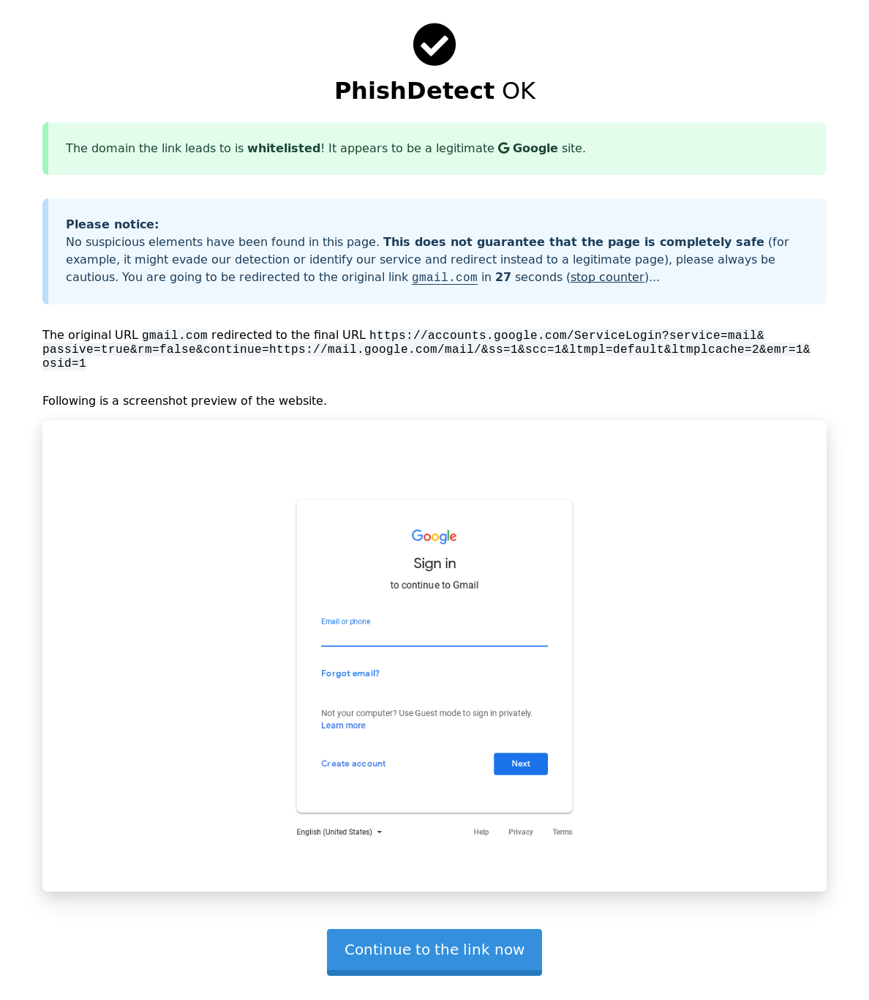

If you are suspicious of a webpage you have opened or a link you have received, you can ask the configured PhishDetect Node to scan scan them for phishing. A PhishDetect Node is a service that securely conducts the scanning of the suspicious link or page. Every newly installed brower extension comes pre-configured with a default PhishDetect Node located at node.phishdetect.io, which is operated by the creators of PhishDetect.

## Scanning links and pages

If you have received a link (for example through a private message or via social media) and you want to check it, you can right-click on the link and use the menu option "Scan this link for phishing":

If you already have open a page you are suspicious of, you can right-click on the page and use the "Scan this page for phishing" context menu option:

Alternatively, you can click on the hook button in the browser's toolbar and click on the "Scan this page" button:

These last two options have the advantage of analyzing the content of the webpage directly as it was rendered in your browser, therefore likely avoiding any potential anti-detection system the phishing kit might implement. These options are also normally a lot faster.

## Integration with Gmail

When you click on a link contained inside the body of an email through the Gmail web interface, you should be presented with the following dialog:

The ? button takes you here.

By pressing the Directly red button, you are directed straight to the original link.

By pressing the Safely green button, you are directed to this service. This service will analyze the link and try to determine whether there is anything suspicious with it.

## Verdict

In case any suspicious element is found, you will be presented with a preview of the page and a warning.

If nothing suspicious if found, or if the page was even identified to be whitelisted (meaning it belongs to well-known online services such as Google, Facebook, Twitter, etc.) you will be presented with a temporary preview and you will then be redirected to the original link after 30 seconds.

