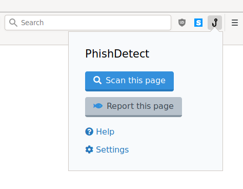

In order to use PhishDetect, the primary software you will need to install is the **PhishDetect Browser Extension**. This extension is available for Chrome and Mozilla Firefox browsers, and you can find the respective download links in the [Download](/download/) page.

Once you have installed the extension, you should notice a hook icon appearing in your browser's toolbar which is normally placed on the top-right of the browser's window, next to the address bar. By clicking on the hook button you will open a popup dialog like the following:

The first **Scan this page!** button will ask PhishDetect to scan the currently opened web page. The **Help** link will open a help page similar to this documentation. The **Settings** link will open an additional dialog that will look like the following:

The PhishDetect Browser Extension needs to be configured to communicate to what is called a **PhishDetect Node**. By default the extension is configured to communicate with a node located at **node.phishdetect.io**, which is operated by the creators of PhishDetect. However, through the Settings form you can change it to any other Node you prefer. For example, if you work for an organization that operates its own PhishDetect Node, you might have been provided with a PhishDetect Node address which you can enter through this form.

<b>Please note:</b> if you decide to use an independent PhishDetect Node, we can not know the identity or intentions of its operators. <b>We do not take any responsibility for the actions of PhishDetect Nodes operators, and you rely on them at your own risk.</b> Please make sure you use a PhishDetect Node operated by a trusted party, and refer to them for any concerns you might have.

You will find the options *Enable Webmails integration* and *Report alerts to PhishDetect Node* enabled by default. The first option simply allows the browser extension to attempt to integrate with supported webmails (currently only Gmail and Roundcube). The second option allows the browser extension to send notifications to the configured PhishDetect Node in case it detects any suspicious pages or emails.

## If the Node requires authentication

Depending on its configuration, your preferred PhishDetect Node could require a **secret token** in order to authenticate its users. If this is the case, after installation you should see the hook icon in the toolbar showing a red warning sign.

Clicking on the link in the popup will lead you to the registration form where you can enter your **secret token**:

If you do not yet have a secret token, you can click on the *Register here* link and request an account from your preferred PhishDetect Node.

**That is all!** There is nothing else you need to do! You can proceed to the [How to Use](/help/how-to-use/) guide.
